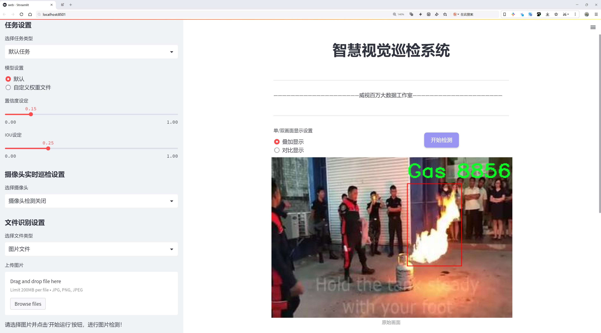
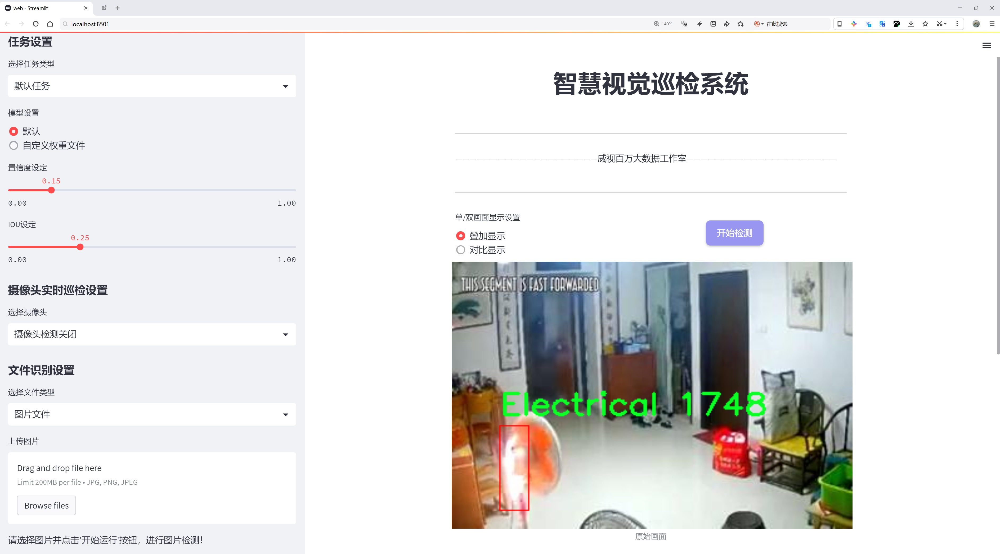
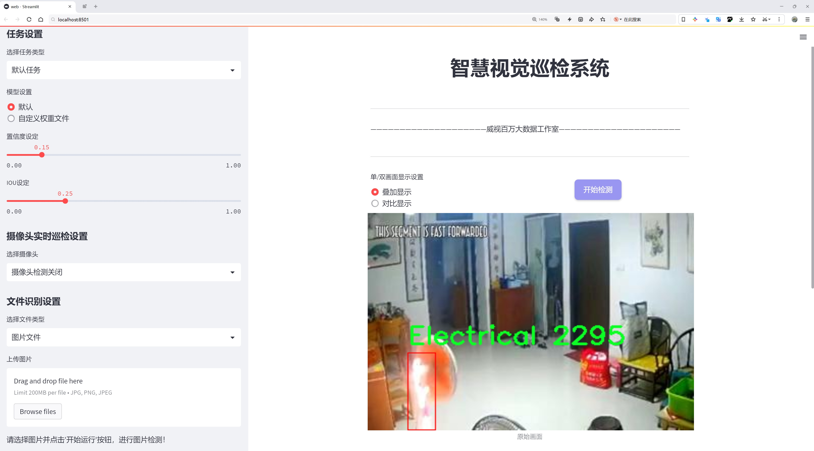
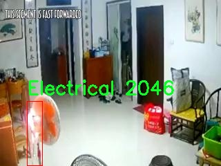
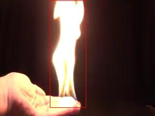
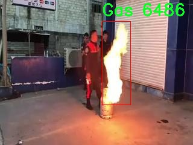
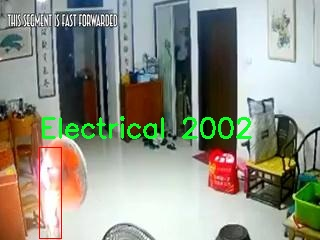

# 火源类型检测系统源码分享
 # [一条龙教学YOLOV8标注好的数据集一键训练_70+全套改进创新点发刊_Web前端展示]

### 1.研究背景与意义

项目参考[AAAI Association for the Advancement of Artificial Intelligence](https://gitee.com/qunmasj/projects)

项目来源[AACV Association for the Advancement of Computer Vision](https://github.com/qunshansj/good)

研究背景与意义

随着城市化进程的加快和工业化水平的提高，火灾事故的发生频率逐年上升，给社会带来了巨大的经济损失和人员伤亡。因此，火源的及时检测与分类成为了火灾防控领域的重要研究课题。传统的火源检测方法多依赖于人工监测和简单的传感器，这些方法不仅效率低下，而且在复杂环境中容易出现误判。近年来，深度学习技术的迅猛发展为火源检测提供了新的解决方案，尤其是基于卷积神经网络（CNN）的目标检测模型在图像识别任务中表现出了优异的性能。

YOLO（You Only Look Once）系列模型因其高效的实时检测能力而广泛应用于各种目标检测任务。YOLOv8作为该系列的最新版本，结合了多种先进的网络结构和优化算法，具备了更强的特征提取能力和更快的推理速度。然而，尽管YOLOv8在一般目标检测任务中表现出色，但在特定的火源类型检测中仍存在一定的局限性，尤其是在不同火源类型的特征区分和环境适应性方面。因此，基于改进YOLOv8的火源类型系统的研究具有重要的理论和实际意义。

本研究将利用一个包含9128张图像的多类别火源数据集，该数据集涵盖了六种火源类型：烹饪油、电气、气体、液体、金属和固体。这些类别的选择不仅反映了日常生活中常见的火源类型，也代表了不同火源在燃烧特性和危险性上的差异。通过对这些火源类型的深入分析与研究，可以为火灾预防和应急响应提供更为精准的技术支持。

在技术层面上，本研究将对YOLOv8进行改进，旨在提升其在火源类型检测中的准确性和鲁棒性。具体而言，研究将聚焦于网络结构的优化、数据增强技术的应用以及损失函数的改进等方面，以期在复杂环境下实现对火源类型的快速、准确识别。通过对不同火源特征的学习与提取，研究将探讨如何提高模型在实际应用中的适应性，尤其是在低光照、烟雾和其他干扰因素存在的情况下。

此外，本研究的成果将为火灾监测系统的智能化发展提供理论基础和技术支持。通过实现对火源类型的精准识别，可以有效提高火灾报警系统的灵敏度，减少误报和漏报的发生，进而提升火灾应急响应的效率。这不仅有助于保护人民生命财产安全，也为社会的可持续发展贡献力量。

综上所述，基于改进YOLOv8的火源类型系统的研究不仅具有重要的学术价值，也在实际应用中展现出广阔的前景。通过本研究的深入开展，期望能够为火灾防控领域提供新的思路和方法，推动智能监测技术的发展，为构建安全、和谐的社会环境贡献力量。

### 2.图片演示







##### 注意：由于此博客编辑较早，上面“2.图片演示”和“3.视频演示”展示的系统图片或者视频可能为老版本，新版本在老版本的基础上升级如下：（实际效果以升级的新版本为准）

  （1）适配了YOLOV8的“目标检测”模型和“实例分割”模型，通过加载相应的权重（.pt）文件即可自适应加载模型。

  （2）支持“图片识别”、“视频识别”、“摄像头实时识别”三种识别模式。

  （3）支持“图片识别”、“视频识别”、“摄像头实时识别”三种识别结果保存导出，解决手动导出（容易卡顿出现爆内存）存在的问题，识别完自动保存结果并导出到tempDir中。

  （4）支持Web前端系统中的标题、背景图等自定义修改，后面提供修改教程。

  另外本项目提供训练的数据集和训练教程,暂不提供权重文件（best.pt）,需要您按照教程进行训练后实现图片演示和Web前端界面演示的效果。

### 3.视频演示

[3.1 视频演示](https://www.bilibili.com/video/BV1z8ssedERj/?vd_source=ff015de2d29cbe2a9cdbfa7064407a08)

### 4.数据集信息展示

数据集信息展示

本数据集专注于火源检测，旨在为改进YOLOv8模型提供高质量的训练数据。数据集包含9128张图像，涵盖了六种不同的火源类型，分别为：烹饪油、电气、气体、液体、金属和固体。这些类别的选择不仅反映了现实生活中常见的火源类型，也为模型的多样性和适应性提供了丰富的训练基础。

在图像采集过程中，数据集涵盖了多种场景和环境，以确保模型能够在不同条件下有效识别火源。每一类火源的图像都经过精心挑选，确保其具有代表性和多样性。例如，烹饪油类的图像可能包括厨房环境中的油锅，而电气类则可能展示了电器设备周围的火源情境。气体类图像则可能涉及燃气灶等设备，液体类则包括可燃液体的容器，金属类则可能展示电焊等场景，固体类则可能涉及木材等易燃物质。这种多样化的图像数据不仅能够提高模型的准确性，还能增强其在实际应用中的鲁棒性。

数据集的每一张图像都附带了详细的标注信息，确保模型在训练过程中能够准确学习到每种火源的特征。这些标注信息包括火源的类别、位置以及相关的上下文信息，使得模型能够在不同的场景中识别出火源的存在。这种精细的标注方式对于提高模型的检测精度至关重要，尤其是在复杂环境中，火源可能与其他物体混合在一起。

此外，数据集的使用遵循CC BY 4.0许可证，这意味着用户可以自由地使用、修改和分发数据集，只需给予适当的署名。这种开放的许可证政策鼓励研究人员和开发者在火源检测领域进行更多的探索和创新，推动技术的进步和应用的广泛。

在训练过程中，改进YOLOv8模型将利用这一数据集的丰富信息，进行深度学习算法的优化。YOLOv8作为一种先进的目标检测模型，具备高效的实时检测能力和优越的精度，通过引入本数据集，模型将能够更好地适应不同类型火源的检测需求。这不仅有助于提升火源检测的准确性，也为火灾预防和安全监测提供了强有力的技术支持。

总之，本数据集为火源检测领域提供了一个全面而多样的基础，旨在推动相关技术的发展。通过结合丰富的图像数据和精确的标注信息，研究人员和开发者可以在火源检测的研究和应用中取得更为显著的成果。










### 5.全套项目环境部署视频教程（零基础手把手教学）

[5.1 环境部署教程链接（零基础手把手教学）](https://www.ixigua.com/7404473917358506534?logTag=c807d0cbc21c0ef59de5)


[5.2 安装Python虚拟环境创建和依赖库安装视频教程链接（零基础手把手教学）](https://www.ixigua.com/7404474678003106304?logTag=1f1041108cd1f708b01a)

### 6.手把手YOLOV8训练视频教程（零基础小白有手就能学会）

[6.1 环境部署教程链接（零基础手把手教学）](https://www.ixigua.com/7404477157818401292?logTag=d31a2dfd1983c9668658)

### 7.70+种全套YOLOV8创新点代码加载调参视频教程（一键加载写好的改进模型的配置文件）

[7.1 环境部署教程链接（零基础手把手教学）](https://www.ixigua.com/7404478314661806627?logTag=29066f8288e3f4eea3a4)

### 8.70+种全套YOLOV8创新点原理讲解（非科班也可以轻松写刊发刊，V10版本正在科研待更新）

由于篇幅限制，每个创新点的具体原理讲解就不一一展开，具体见下列网址中的创新点对应子项目的技术原理博客网址【Blog】：


[8.1 70+种全套YOLOV8创新点原理讲解链接](https://gitee.com/qunmasj/good)

### 9.系统功能展示（检测对象为举例，实际内容以本项目数据集为准）

图9.1.系统支持检测结果表格显示

  图9.2.系统支持置信度和IOU阈值手动调节

  图9.3.系统支持自定义加载权重文件best.pt(需要你通过步骤5中训练获得)

  图9.4.系统支持摄像头实时识别

  图9.5.系统支持图片识别

  图9.6.系统支持视频识别

  图9.7.系统支持识别结果文件自动保存

  图9.8.系统支持Excel导出检测结果数据


### 10.原始YOLOV8算法原理

原始YOLOv8算法原理

YOLOv8作为YOLO系列的最新版本，于2023年1月10日正式发布，标志着计算机视觉领域在目标检测、分类和分割任务中的又一次重大进步。它不仅在精度和执行时间上超越了前代模型，还在结构设计上进行了全面的创新与优化，充分吸收了YOLOv5、YOLOv6、YOLOX等模型的优点，成为当前最先进的实时目标检测模型。

YOLOv8的核心在于其高效的模型架构，主要由Backbone、Neck和Head三部分组成。Backbone负责特征提取，采用了CSPDarknet结构，利用跨阶段局部网络（CSP）来增强特征图的表达能力。与YOLOv5相比，YOLOv8将C3模块替换为C2f模块，C2f模块通过将输入特征图分成两个分支并分别进行卷积操作，能够更有效地提取特征信息。每个分支的输出再通过卷积层进行融合，从而形成更高维度的特征图，增强了模型的梯度流动性。这种设计不仅提高了特征提取的效率，还在一定程度上降低了模型的参数量。

在Neck部分，YOLOv8采用了快速空间金字塔池化（SPPF）结构，旨在提取不同尺度的特征。这一结构通过对特征图进行多尺度处理，有效地减少了计算量，同时提高了特征提取的效率。结合特征金字塔网络（FPN）和路径聚合网络（PAN），YOLOv8能够在不同层次上对特征进行处理和压缩，从而更好地适应各种目标的检测需求。

YOLOv8的Head部分是其创新的亮点之一。传统的YOLO模型通常采用锚框（Anchor-Based）的方法进行目标检测，而YOLOv8则引入了无锚框（Anchor-Free）的检测方式。这一转变使得模型在预测目标时不再依赖于预定义的锚框，而是直接预测目标的中心点及其宽高比例。这种方法显著减少了锚框的数量，提升了检测速度和准确度，同时简化了模型的设计。解耦的分类和回归分支进一步提高了模型的灵活性，使得YOLOv8在处理复杂场景时表现得更加出色。

YOLOv8的损失函数也进行了重新设计，以适应新的检测头结构。通过优化损失函数，YOLOv8能够更好地平衡分类和定位的精度，进一步提升整体检测性能。这种改进使得YOLOv8在处理小目标和高分辨率图像时表现尤为突出，适应了现代计算机视觉应用中对精度和速度的双重需求。

值得一提的是，YOLOv8的工程化设计使其在不同硬件平台上都能高效运行，无论是CPU还是GPU，都能实现快速的目标检测。这种灵活性使得YOLOv8能够广泛应用于智能监控、自动驾驶、医疗影像分析等多个领域，为各类应用场景提供了强大的技术支持。

在实际应用中，YOLOv8展现出了极高的准确性和实时性。通过多尺度训练和测试，YOLOv8能够适应不同尺寸和复杂度的输入图像，确保在各种环境下都能保持优异的检测性能。与前代模型相比，YOLOv8在精度和帧率上均有显著提升，特别是在小目标检测和高分辨率图像处理方面，展现出了更强的能力。

总的来说，YOLOv8不仅是YOLO系列的延续，更是对目标检测技术的一次全面革新。通过引入无锚框检测、优化的网络结构和高效的特征提取方法，YOLOv8在保持高精度的同时，极大地提升了检测速度，成为当前计算机视觉领域中不可或缺的工具。随着YOLOv8的广泛应用，未来的目标检测任务将迎来更加智能化和高效化的解决方案。


### 11.项目核心源码讲解（再也不用担心看不懂代码逻辑）

#### 11.1 ultralytics\models\sam\predict.py

以下是对代码中最核心部分的分析和详细注释。代码主要涉及使用Segment Anything Model (SAM)进行图像分割的预测过程。

```python
import numpy as np
import torch
import torch.nn.functional as F
import torchvision

from ultralytics.data.augment import LetterBox
from ultralytics.engine.predictor import BasePredictor
from ultralytics.engine.results import Results
from ultralytics.utils import ops
from .build import build_sam

class Predictor(BasePredictor):
    """
    Predictor类用于Segment Anything Model (SAM)，继承自BasePredictor。
    提供了一个接口用于图像分割任务的模型推理。
    """

    def __init__(self, cfg=DEFAULT_CFG, overrides=None, _callbacks=None):
        """
        初始化Predictor，设置配置、覆盖和回调。
        """
        if overrides is None:
            overrides = {}
        overrides.update(dict(task="segment", mode="predict", imgsz=1024))
        super().__init__(cfg, overrides, _callbacks)
        self.args.retina_masks = True  # 启用retina_masks以获得最佳结果
        self.im = None  # 存储输入图像
        self.features = None  # 存储提取的图像特征
        self.prompts = {}  # 存储各种提示类型
        self.segment_all = False  # 控制是否分割所有对象

    def preprocess(self, im):
        """
        对输入图像进行预处理，为模型推理做准备。
        """
        if self.im is not None:
            return self.im  # 如果已经处理过，直接返回
        not_tensor = not isinstance(im, torch.Tensor)
        if not_tensor:
            im = np.stack(self.pre_transform(im))  # 将输入转换为张量
            im = im[..., ::-1].transpose((0, 3, 1, 2))  # 转换为BCHW格式
            im = np.ascontiguousarray(im)
            im = torch.from_numpy(im)

        im = im.to(self.device)  # 将图像移动到指定设备
        im = im.half() if self.model.fp16 else im.float()  # 根据模型设置转换数据类型
        if not_tensor:
            im = (im - self.mean) / self.std  # 进行标准化
        return im

    def inference(self, im, bboxes=None, points=None, labels=None, masks=None, multimask_output=False, *args, **kwargs):
        """
        基于给定的输入提示执行图像分割推理。
        """
        # 如果self.prompts中有存储的提示，则覆盖传入的提示
        bboxes = self.prompts.pop("bboxes", bboxes)
        points = self.prompts.pop("points", points)
        masks = self.prompts.pop("masks", masks)

        if all(i is None for i in [bboxes, points, masks]):
            return self.generate(im, *args, **kwargs)  # 如果没有提示，则生成分割

        return self.prompt_inference(im, bboxes, points, labels, masks, multimask_output)

    def prompt_inference(self, im, bboxes=None, points=None, labels=None, masks=None, multimask_output=False):
        """
        基于提示（如边界框、点和掩码）执行图像分割推理。
        """
        features = self.model.image_encoder(im) if self.features is None else self.features  # 提取图像特征

        # 处理输入提示
        if points is not None:
            points = torch.as_tensor(points, dtype=torch.float32, device=self.device)
            points = points[None] if points.ndim == 1 else points
            if labels is None:
                labels = np.ones(points.shape[0])  # 默认所有点为前景
            labels = torch.as_tensor(labels, dtype=torch.int32, device=self.device)
            points *= r  # 根据缩放因子调整点的位置

        # 嵌入提示并预测掩码
        sparse_embeddings, dense_embeddings = self.model.prompt_encoder(points=points, boxes=bboxes, masks=masks)
        pred_masks, pred_scores = self.model.mask_decoder(
            image_embeddings=features,
            image_pe=self.model.prompt_encoder.get_dense_pe(),
            sparse_prompt_embeddings=sparse_embeddings,
            dense_prompt_embeddings=dense_embeddings,
            multimask_output=multimask_output,
        )

        return pred_masks.flatten(0, 1), pred_scores.flatten(0, 1)  # 返回预测的掩码和分数

    def generate(self, im, crop_n_layers=0, crop_overlap_ratio=512 / 1500, crop_downscale_factor=1, points_stride=32, points_batch_size=64, conf_thres=0.88, stability_score_thresh=0.95, stability_score_offset=0.95, crop_nms_thresh=0.7):
        """
        使用Segment Anything Model (SAM)执行图像分割。
        """
        self.segment_all = True  # 设置为分割所有对象
        ih, iw = im.shape[2:]  # 获取输入图像的高度和宽度
        crop_regions, layer_idxs = generate_crop_boxes((ih, iw), crop_n_layers, crop_overlap_ratio)  # 生成裁剪区域
        pred_masks, pred_scores, pred_bboxes, region_areas = [], [], [], []

        for crop_region, layer_idx in zip(crop_regions, layer_idxs):
            # 对每个裁剪区域进行处理
            x1, y1, x2, y2 = crop_region
            crop_im = F.interpolate(im[..., y1:y2, x1:x2], (ih, iw), mode="bilinear", align_corners=False)  # 裁剪并调整图像大小
            points_for_image = point_grids[layer_idx] * points_scale  # 计算采样点

            # 进行推理
            pred_mask, pred_score = self.prompt_inference(crop_im, points=points, multimask_output=True)
            # 对预测的掩码进行插值
            pred_mask = F.interpolate(pred_mask[None], (h, w), mode="bilinear", align_corners=False)[0]

            # 进行后处理，返回最终的掩码、分数和边界框
            pred_masks.append(pred_mask)
            pred_bboxes.append(pred_bbox)
            pred_scores.append(pred_score)

        return pred_masks, pred_scores, pred_bboxes  # 返回所有预测结果

    def setup_model(self, model, verbose=True):
        """
        初始化Segment Anything Model (SAM)以进行推理。
        """
        device = select_device(self.args.device, verbose=verbose)  # 选择设备
        model.eval()  # 设置模型为评估模式
        self.model = model.to(device)  # 将模型移动到设备
        self.mean = torch.tensor([123.675, 116.28, 103.53]).view(-1, 1, 1).to(device)  # 设置均值
        self.std = torch.tensor([58.395, 57.12, 57.375]).view(-1, 1, 1).to(device)  # 设置标准差

    def postprocess(self, preds, img, orig_imgs):
        """
        对SAM的推理输出进行后处理，生成对象检测掩码和边界框。
        """
        pred_masks, pred_scores = preds[:2]  # 获取掩码和分数
        results = []
        for i, masks in enumerate([pred_masks]):
            orig_img = orig_imgs[i]
            masks = ops.scale_masks(masks[None].float(), orig_img.shape[:2], padding=False)[0]  # 缩放掩码到原始图像大小
            results.append(Results(orig_img, masks=masks))  # 创建结果对象
        return results  # 返回结果列表
```

### 代码核心部分分析
1. **Predictor类**: 该类负责图像分割的整个过程，包括初始化、预处理、推理、生成掩码和后处理。
2. **预处理**: `preprocess`方法负责将输入图像转换为模型可接受的格式，并进行标准化。
3. **推理**: `inference`和`prompt_inference`方法实现了基于提示的推理逻辑，支持边界框、点和掩码等多种输入形式。
4. **生成掩码**: `generate`方法通过对图像进行裁剪和逐层处理，生成最终的分割掩码。
5. **模型设置**: `setup_model`方法负责加载和配置SAM模型。
6. **后处理**: `postprocess`方法将模型输出的掩码和边界框缩放到原始图像大小，并返回结果。

以上是对代码的核心部分及其功能的详细分析和注释。

该文件是Ultralytics YOLO框架中实现Segment Anything Model（SAM）预测逻辑的Python代码。SAM是一种先进的图像分割模型，具有可提示分割和零样本性能等特点。该模块提供了执行图像分割所需的预测逻辑和辅助工具，旨在实现高性能的实时图像分割任务。

文件中首先导入了一些必要的库，包括NumPy、PyTorch及其相关模块、TorchVision等。接着定义了一个`Predictor`类，该类继承自`BasePredictor`，专门用于处理图像分割任务的模型推理。类的构造函数初始化了一些重要的属性，包括配置字典、覆盖参数、回调函数等，并设置了一些默认值，如`retina_masks`标志和图像处理的相关变量。

`preprocess`方法用于对输入图像进行预处理，包括图像的变换和归一化，支持多种输入格式。`pre_transform`方法则在预处理之前对图像进行初步变换，确保输入图像的格式符合模型要求。

`inference`方法是执行图像分割推理的核心函数，接受多种输入提示（如边界框、点、低分辨率掩码等），并调用相应的推理逻辑。如果没有提供任何提示，则调用`generate`方法进行全图分割。

`generate`方法利用SAM的架构对整个图像进行分割，可以选择在图像的裁剪区域上进行更精细的分割。该方法会生成多个图像裁剪区域，并在每个区域内进行推理，最后合并结果。

`setup_model`方法用于初始化SAM模型，包括将模型分配到适当的设备、设置图像归一化参数等。`postprocess`方法则在推理完成后对输出结果进行后处理，生成最终的检测掩码和边界框。

此外，`set_image`和`set_prompts`方法用于设置待处理的图像和提示信息，而`reset_image`方法则重置图像和特征。`remove_small_regions`静态方法用于在分割掩码上执行后处理，去除小的、不连通的区域，并进行非极大值抑制（NMS）以消除重复的边界框。

整体而言，该文件实现了一个灵活且高效的图像分割预测器，能够处理多种输入形式并生成高质量的分割结果，适用于实时图像处理任务。

#### 11.2 ultralytics\utils\callbacks\clearml.py

以下是经过简化和注释的核心代码部分：

```python
# 导入必要的库
from ultralytics.utils import LOGGER, SETTINGS, TESTS_RUNNING

# 尝试导入 ClearML 库并进行一些基本的验证
try:
    assert not TESTS_RUNNING  # 确保不在测试运行中
    assert SETTINGS["clearml"] is True  # 确保 ClearML 集成已启用
    import clearml
    from clearml import Task
    from clearml.binding.frameworks.pytorch_bind import PatchPyTorchModelIO
    from clearml.binding.matplotlib_bind import PatchedMatplotlib

    assert hasattr(clearml, "__version__")  # 确保 ClearML 包不是目录

except (ImportError, AssertionError):
    clearml = None  # 如果导入失败，则将 clearml 设置为 None


def on_pretrain_routine_start(trainer):
    """在预训练例程开始时运行；初始化并连接/记录任务到 ClearML。"""
    try:
        task = Task.current_task()  # 获取当前任务
        if task:
            # 禁用自动的 PyTorch 和 Matplotlib 绑定
            PatchPyTorchModelIO.update_current_task(None)
            PatchedMatplotlib.update_current_task(None)
        else:
            # 初始化新的 ClearML 任务
            task = Task.init(
                project_name=trainer.args.project or "YOLOv8",  # 项目名称
                task_name=trainer.args.name,  # 任务名称
                tags=["YOLOv8"],  # 标签
                output_uri=True,
                reuse_last_task_id=False,
                auto_connect_frameworks={"pytorch": False, "matplotlib": False},
            )
            LOGGER.warning(
                "ClearML Initialized a new task. If you want to run remotely, "
                "please add clearml-init and connect your arguments before initializing YOLO."
            )
        task.connect(vars(trainer.args), name="General")  # 连接训练参数
    except Exception as e:
        LOGGER.warning(f"WARNING ⚠️ ClearML installed but not initialized correctly, not logging this run. {e}")


def on_train_epoch_end(trainer):
    """在 YOLO 训练的每个 epoch 结束时记录调试样本并报告当前训练进度。"""
    task = Task.current_task()  # 获取当前任务
    if task:
        # 记录调试样本
        if trainer.epoch == 1:
            _log_debug_samples(sorted(trainer.save_dir.glob("train_batch*.jpg")), "Mosaic")
        # 报告当前训练进度
        for k, v in trainer.label_loss_items(trainer.tloss, prefix="train").items():
            task.get_logger().report_scalar("train", k, v, iteration=trainer.epoch)
        for k, v in trainer.lr.items():
            task.get_logger().report_scalar("lr", k, v, iteration=trainer.epoch)


def on_train_end(trainer):
    """在训练完成时记录最终模型及其名称。"""
    task = Task.current_task()  # 获取当前任务
    if task:
        # 记录最终结果，混淆矩阵 + PR 图
        files = [
            "results.png",
            "confusion_matrix.png",
            "confusion_matrix_normalized.png",
            *(f"{x}_curve.png" for x in ("F1", "PR", "P", "R")),
        ]
        files = [(trainer.save_dir / f) for f in files if (trainer.save_dir / f).exists()]  # 过滤存在的文件
        for f in files:
            _log_plot(title=f.stem, plot_path=f)  # 记录图像
        # 报告最终指标
        for k, v in trainer.validator.metrics.results_dict.items():
            task.get_logger().report_single_value(k, v)
        # 记录最终模型
        task.update_output_model(model_path=str(trainer.best), model_name=trainer.args.name, auto_delete_file=False)


# 定义回调函数
callbacks = (
    {
        "on_pretrain_routine_start": on_pretrain_routine_start,
        "on_train_epoch_end": on_train_epoch_end,
        "on_train_end": on_train_end,
    }
    if clearml
    else {}
)
```

### 代码说明：
1. **导入库**：导入了必要的库和模块，包括 `clearml` 用于任务管理。
2. **异常处理**：在导入过程中进行异常处理，确保 ClearML 正确安装并配置。
3. **任务初始化**：在预训练开始时，初始化 ClearML 任务并连接训练参数。
4. **训练过程记录**：在每个训练 epoch 结束时，记录调试样本和训练进度，包括损失和学习率。
5. **训练结束记录**：在训练结束时，记录最终模型和相关指标，包括混淆矩阵和其他图表。

这些核心部分和注释帮助理解代码的主要功能和逻辑。

这个程序文件 `clearml.py` 是用于集成 ClearML 以便在 Ultralytics YOLO 训练过程中进行日志记录和监控的工具。文件中首先导入了一些必要的模块和类，并进行了错误处理，以确保 ClearML 库的可用性和设置的正确性。

文件定义了一些函数，这些函数在训练的不同阶段被调用，以记录相关的信息。例如，`_log_debug_samples` 函数用于将调试样本（如图像）记录到当前的 ClearML 任务中。它接受文件路径列表和标题作为参数，并通过正则表达式提取批次信息，记录每个图像的相关信息。

`_log_plot` 函数则用于将图像作为绘图记录到 ClearML 的绘图部分。它使用 Matplotlib 读取图像并生成一个无坐标轴的图形，然后将其记录到当前任务中。

在训练的预处理阶段，`on_pretrain_routine_start` 函数会被调用。它会初始化 ClearML 任务并连接相关参数，确保 PyTorch 和 Matplotlib 的自动绑定被禁用，以便手动记录这些信息。如果当前没有任务，则会创建一个新的任务并发出警告，提示用户需要在运行之前进行 ClearML 的初始化。

`on_train_epoch_end` 函数在每个训练周期结束时被调用，记录调试样本和当前的训练进度。它会在第一轮训练时记录调试样本，并将训练损失和学习率等信息记录到任务中。

`on_fit_epoch_end` 函数在每个训练周期结束时报告模型信息，包括当前周期的时间和验证指标。

`on_val_end` 函数用于在验证结束时记录验证结果，包括标签和预测的图像。

最后，`on_train_end` 函数在训练完成时被调用，记录最终模型及其名称。它会记录最终的结果图像、混淆矩阵和其他性能指标，并更新输出模型。

在文件的最后，定义了一个 `callbacks` 字典，包含了在不同训练阶段调用的函数。如果 ClearML 可用，则将这些函数添加到字典中，否则字典为空。这种设计使得代码在没有 ClearML 的情况下也能正常运行。

#### 11.3 ui.py

```python
import sys
import subprocess

def run_script(script_path):
    """
    使用当前 Python 环境运行指定的脚本。

    Args:
        script_path (str): 要运行的脚本路径

    Returns:
        None
    """
    # 获取当前 Python 解释器的路径
    python_path = sys.executable

    # 构建运行命令，使用 streamlit 运行指定的脚本
    command = f'"{python_path}" -m streamlit run "{script_path}"'

    # 执行命令
    result = subprocess.run(command, shell=True)
    # 检查命令执行的返回码，如果不为0则表示出错
    if result.returncode != 0:
        print("脚本运行出错。")


# 实例化并运行应用
if __name__ == "__main__":
    # 指定要运行的脚本路径
    script_path = "web.py"  # 这里可以替换为实际的脚本路径

    # 调用函数运行脚本
    run_script(script_path)
```

### 代码注释说明：
1. **导入模块**：
   - `sys`：用于获取当前 Python 解释器的路径。
   - `subprocess`：用于执行外部命令。

2. **`run_script` 函数**：
   - 该函数接受一个参数 `script_path`，表示要运行的 Python 脚本的路径。
   - 使用 `sys.executable` 获取当前 Python 解释器的路径。
   - 构建一个命令字符串，使用 `streamlit` 模块运行指定的脚本。
   - 使用 `subprocess.run` 执行构建的命令，并通过 `shell=True` 允许在 shell 中执行。
   - 检查命令的返回码，如果返回码不为0，表示脚本运行出错，打印错误信息。

3. **主程序块**：
   - 通过 `if __name__ == "__main__":` 确保只有在直接运行该脚本时才会执行以下代码。
   - 指定要运行的脚本路径（这里使用了 `web.py`，可以根据需要修改）。
   - 调用 `run_script` 函数来运行指定的脚本。

这个程序文件名为 `ui.py`，主要功能是通过当前的 Python 环境来运行一个指定的脚本。程序首先导入了必要的模块，包括 `sys`、`os` 和 `subprocess`，以及一个自定义的模块 `QtFusion.path` 中的 `abs_path` 函数。

在程序中定义了一个名为 `run_script` 的函数，该函数接受一个参数 `script_path`，这个参数是要运行的脚本的路径。函数内部首先获取当前 Python 解释器的路径，并将其存储在 `python_path` 变量中。接着，构建一个命令字符串，使用 `streamlit` 来运行指定的脚本，这个命令是通过格式化字符串的方式生成的。

然后，使用 `subprocess.run` 方法来执行这个命令。`shell=True` 参数表示在一个新的 shell 中执行命令。执行完命令后，程序检查返回的结果，如果返回码不为 0，说明脚本运行出错，程序会打印出相应的错误信息。

在文件的最后部分，使用 `if __name__ == "__main__":` 来判断当前模块是否是主程序，如果是，则指定要运行的脚本路径为 `web.py`，并调用 `run_script` 函数来执行这个脚本。

整体来看，这个程序的主要作用是提供一个简单的接口来运行一个名为 `web.py` 的脚本，使用了 `streamlit` 作为运行环境，并且能够处理运行过程中的错误。

#### 11.4 ultralytics\models\rtdetr\predict.py

以下是代码中最核心的部分，并附上详细的中文注释：

```python
import torch
from ultralytics.data.augment import LetterBox
from ultralytics.engine.predictor import BasePredictor
from ultralytics.engine.results import Results
from ultralytics.utils import ops

class RTDETRPredictor(BasePredictor):
    """
    RT-DETR (Real-Time Detection Transformer) 预测器，扩展自 BasePredictor 类，用于使用百度的 RT-DETR 模型进行预测。
    该类利用视觉变换器的强大功能，提供实时物体检测，同时保持高精度。
    支持高效的混合编码和 IoU 感知查询选择等关键特性。
    """

    def postprocess(self, preds, img, orig_imgs):
        """
        对模型的原始预测结果进行后处理，以生成边界框和置信度分数。

        该方法根据置信度和类进行过滤，如果在 `self.args` 中指定了类。

        参数:
            preds (torch.Tensor): 模型的原始预测结果。
            img (torch.Tensor): 处理后的输入图像。
            orig_imgs (list or torch.Tensor): 原始的未处理图像。

        返回:
            (list[Results]): 包含后处理边界框、置信度分数和类标签的 Results 对象列表。
        """
        # 获取预测结果的维度
        nd = preds[0].shape[-1]
        # 将预测结果分割为边界框和分数
        bboxes, scores = preds[0].split((4, nd - 4), dim=-1)

        # 如果输入图像不是列表，则将其转换为 numpy 格式
        if not isinstance(orig_imgs, list):
            orig_imgs = ops.convert_torch2numpy_batch(orig_imgs)

        results = []
        for i, bbox in enumerate(bboxes):  # 遍历每个边界框
            # 将边界框从 xywh 格式转换为 xyxy 格式
            bbox = ops.xywh2xyxy(bbox)
            # 获取每个边界框的最大分数和对应的类
            score, cls = scores[i].max(-1, keepdim=True)
            # 根据置信度过滤边界框
            idx = score.squeeze(-1) > self.args.conf
            # 如果指定了类，则进一步过滤
            if self.args.classes is not None:
                idx = (cls == torch.tensor(self.args.classes, device=cls.device)).any(1) & idx
            # 合并边界框、分数和类，并根据索引进行过滤
            pred = torch.cat([bbox, score, cls], dim=-1)[idx]
            orig_img = orig_imgs[i]
            oh, ow = orig_img.shape[:2]  # 获取原始图像的高度和宽度
            # 将边界框的坐标缩放到原始图像的尺寸
            pred[..., [0, 2]] *= ow
            pred[..., [1, 3]] *= oh
            img_path = self.batch[0][i]  # 获取图像路径
            # 将结果添加到列表中
            results.append(Results(orig_img, path=img_path, names=self.model.names, boxes=pred))
        return results

    def pre_transform(self, im):
        """
        在将输入图像送入模型进行推理之前，对其进行预处理。
        输入图像被调整为方形比例并填充，尺寸必须为方形(640)并且填充比例。

        参数:
            im (list[np.ndarray] | torch.Tensor): 输入图像，形状为 (N,3,h,w) 的张量，或 [(h,w,3) x N] 的列表。

        返回:
            (list): 预处理后的图像列表，准备进行模型推理。
        """
        # 创建 LetterBox 对象以进行图像预处理
        letterbox = LetterBox(self.imgsz, auto=False, scaleFill=True)
        # 对每个图像进行预处理并返回
        return [letterbox(image=x) for x in im]
```

### 代码核心部分解释：
1. **RTDETRPredictor 类**：这是一个用于实时物体检测的预测器，扩展自 `BasePredictor` 类，使用百度的 RT-DETR 模型。
2. **postprocess 方法**：对模型的原始预测结果进行后处理，生成边界框和置信度分数，并根据置信度和类进行过滤。
3. **pre_transform 方法**：对输入图像进行预处理，确保其为方形并填充，以适应模型的输入要求。

这个程序文件 `ultralytics\models\rtdetr\predict.py` 定义了一个名为 `RTDETRPredictor` 的类，该类继承自 `BasePredictor`，用于使用百度的 RT-DETR 模型进行实时目标检测。RT-DETR 模型结合了视觉变换器的优势，能够在保持高精度的同时实现实时的物体检测。该类支持高效的混合编码和 IoU（Intersection over Union）感知查询选择等关键特性。

在类的文档字符串中，提供了一个使用示例，展示了如何通过传入模型路径和数据源来初始化预测器，并调用 `predict_cli` 方法进行预测。

类中定义了两个主要的方法：`postprocess` 和 `pre_transform`。

`postprocess` 方法负责对模型的原始预测结果进行后处理，以生成边界框和置信度分数。该方法首先将预测结果分为边界框和分数，然后根据置信度和指定的类别进行过滤。对于每个边界框，方法将其坐标从中心点宽高格式转换为左上角和右下角格式，并将坐标缩放到原始图像的尺寸。最后，将处理后的结果封装成 `Results` 对象并返回。

`pre_transform` 方法用于在将输入图像送入模型进行推理之前进行预处理。它使用 `LetterBox` 类将输入图像调整为正方形，并确保填充比例正确。该方法接受一组图像，并返回经过预处理的图像列表，准备好进行模型推理。

整体来看，这个文件实现了 RT-DETR 模型的预测功能，包含了从输入图像预处理到模型输出后处理的完整流程，为实时目标检测提供了一个高效的解决方案。

#### 11.5 train.py

以下是代码中最核心的部分，并附上详细的中文注释：

```python
import os
import torch
import yaml
from ultralytics import YOLO  # 导入YOLO模型库
from QtFusion.path import abs_path  # 导入路径处理函数

# 设置设备为GPU（如果可用），否则使用CPU
device = "0" if torch.cuda.is_available() else "cpu"

if __name__ == '__main__':  # 确保该模块被直接运行时才执行以下代码
    workers = 1  # 设置数据加载的工作进程数
    batch = 2    # 设置每个批次的大小

    data_name = "data"  # 数据集名称
    # 获取数据集配置文件的绝对路径
    data_path = abs_path(f'datasets/{data_name}/{data_name}.yaml', path_type='current')  
    unix_style_path = data_path.replace(os.sep, '/')  # 将路径转换为Unix风格

    # 获取数据集所在目录的路径
    directory_path = os.path.dirname(unix_style_path)
    
    # 读取YAML文件，保持原有顺序
    with open(data_path, 'r') as file:
        data = yaml.load(file, Loader=yaml.FullLoader)
    
    # 如果YAML文件中包含'path'项，则修改为当前目录路径
    if 'path' in data:
        data['path'] = directory_path
        # 将修改后的数据写回YAML文件
        with open(data_path, 'w') as file:
            yaml.safe_dump(data, file, sort_keys=False)

    # 加载预训练的YOLOv8模型
    model = YOLO(model='./ultralytics/cfg/models/v8/yolov8s.yaml', task='detect')  
    
    # 开始训练模型
    results2 = model.train(
        data=data_path,  # 指定训练数据的配置文件路径
        device=device,  # 使用之前设置的设备
        workers=workers,  # 指定使用的工作进程数
        imgsz=640,  # 指定输入图像的大小为640x640
        epochs=100,  # 指定训练100个epoch
        batch=batch,  # 指定每个批次的大小
        name='train_v8_' + data_name  # 指定训练任务的名称
    )
```

### 代码说明：
1. **导入必要的库**：代码开始时导入了处理文件路径、深度学习框架（PyTorch）、YAML文件处理和YOLO模型的相关库。
2. **设备选择**：根据是否有可用的GPU，选择使用GPU或CPU进行模型训练。
3. **数据集路径处理**：通过`abs_path`函数获取数据集的YAML配置文件的绝对路径，并将其转换为Unix风格的路径。
4. **读取和修改YAML文件**：读取数据集的YAML文件，修改其中的`path`项为当前目录路径，并将修改后的内容写回文件。
5. **模型加载**：加载YOLOv8的预训练模型，准备进行训练。
6. **模型训练**：调用`model.train`方法开始训练，传入训练数据的配置文件路径、设备、工作进程数、图像大小、训练轮数和批次大小等参数。

该程序文件 `train.py` 是一个用于训练 YOLOv8 模型的脚本。首先，程序导入了必要的库，包括 `os`、`torch`、`yaml` 和 `ultralytics` 中的 YOLO 模型。接着，程序检查当前是否可以使用 GPU，如果可以，则将设备设置为 "0"（表示使用第一个 GPU），否则使用 CPU。

在 `if __name__ == '__main__':` 语句下，程序确保只有在直接运行该脚本时才会执行以下代码。程序设置了工作进程数量为 1，批次大小为 2，并定义了数据集的名称为 "data"。接着，程序构建了数据集 YAML 文件的绝对路径，并将路径中的分隔符替换为 Unix 风格的斜杠。

程序获取了数据集目录的路径，并打开 YAML 文件以读取数据。通过 `yaml.load` 方法，程序将 YAML 文件的内容加载到 `data` 变量中。接下来，如果数据中包含 'path' 项，程序会将其修改为目录路径，并将更新后的数据写回 YAML 文件中。

随后，程序加载了预训练的 YOLOv8 模型，指定了模型配置文件的路径。接下来，程序调用 `model.train` 方法开始训练模型，传入训练数据的配置文件路径、设备、工作进程数量、输入图像大小（640x640）、训练的 epoch 数量（100）、批次大小（2）以及训练任务的名称。

总体来说，该脚本的主要功能是设置训练环境、准备数据集并启动 YOLOv8 模型的训练过程。

#### 11.6 ultralytics\models\yolo\segment\__init__.py

```python
# 导入必要的模块和类
from .predict import SegmentationPredictor  # 导入分割预测器类
from .train import SegmentationTrainer      # 导入分割训练器类
from .val import SegmentationValidator      # 导入分割验证器类

# 定义模块的公开接口，指定可以被外部访问的类
__all__ = "SegmentationPredictor", "SegmentationTrainer", "SegmentationValidator"
```

### 代码注释说明：
1. **导入模块**：
   - `from .predict import SegmentationPredictor`：从当前包的 `predict` 模块中导入 `SegmentationPredictor` 类，用于图像分割的预测功能。
   - `from .train import SegmentationTrainer`：从当前包的 `train` 模块中导入 `SegmentationTrainer` 类，用于训练分割模型。
   - `from .val import SegmentationValidator`：从当前包的 `val` 模块中导入 `SegmentationValidator` 类，用于验证分割模型的性能。

2. **定义公开接口**：
   - `__all__` 是一个特殊变量，用于定义模块的公共接口。它指定了在使用 `from module import *` 时，哪些类可以被导入。在这里，`SegmentationPredictor`、`SegmentationTrainer` 和 `SegmentationValidator` 是该模块对外公开的类。

这个程序文件是Ultralytics YOLO（You Only Look Once）项目中的一个模块，主要用于图像分割任务。文件名为`__init__.py`，通常用于标识一个目录为Python包，并可以在包被导入时执行一些初始化操作。

在这个文件中，首先有一行注释，表明该项目使用的是AGPL-3.0许可证，并且是Ultralytics YOLO的一个部分。接下来，文件通过相对导入的方式引入了三个类：`SegmentationPredictor`、`SegmentationTrainer`和`SegmentationValidator`。这些类分别负责图像分割的预测、训练和验证功能。

最后，`__all__`变量被定义为一个元组，包含了这三个类的名称。这意味着当使用`from ultralytics.models.yolo.segment import *`这种方式导入时，只会导入`SegmentationPredictor`、`SegmentationTrainer`和`SegmentationValidator`这三个类，确保了模块的封装性和清晰性。

总体来说，这个文件的主要作用是将图像分割相关的功能模块化，方便用户在使用YOLO进行图像分割时进行相应的操作。

### 12.系统整体结构（节选）

### 整体功能和构架概括

该项目是一个基于Ultralytics YOLO框架的计算机视觉应用，主要功能包括目标检测和图像分割。项目采用模块化设计，允许用户方便地进行模型训练、预测和评估。主要包含以下几个部分：

1. **模型预测**：实现了不同模型（如SAM、RT-DETR等）的预测逻辑，支持图像分割和目标检测。
2. **训练和验证**：提供了训练和验证模型的功能，支持多种回调机制（如ClearML和TensorBoard）以便于监控训练过程。
3. **用户界面**：提供了一个简单的用户界面，通过命令行运行特定的脚本。
4. **工具和实用程序**：包含了一些实用的工具函数和操作，支持模型的加载、预处理和后处理。

### 文件功能整理表

| 文件路径                                      | 功能描述                                                   |
|-------------------------------------------|--------------------------------------------------------|
| `ultralytics/models/sam/predict.py`      | 实现Segment Anything Model（SAM）的预测逻辑，包括图像预处理和后处理。 |
| `ultralytics/utils/callbacks/clearml.py` | 集成ClearML进行训练过程中的日志记录和监控。                    |
| `ui.py`                                   | 提供一个接口来运行指定的脚本（如`web.py`），用于用户交互。       |
| `ultralytics/models/rtdetr/predict.py`   | 实现RT-DETR模型的预测功能，包括输入图像的预处理和输出结果的后处理。 |
| `train.py`                                | 设置训练环境并启动YOLOv8模型的训练过程。                        |
| `ultralytics/models/yolo/segment/__init__.py` | 模块初始化文件，导入图像分割相关的类（预测器、训练器、验证器）。  |
| `ultralytics/models/yolo/model.py`       | 定义YOLO模型的结构和相关功能（具体功能未提供）。                  |
| `ultralytics/utils/callbacks/tensorboard.py` | 集成TensorBoard进行训练过程中的可视化监控。                      |
| `ultralytics/nn/__init__.py`             | 模块初始化文件，可能包含神经网络相关的类和函数（具体功能未提供）。 |
| `ultralytics/models/utils/ops.py`        | 提供一些操作和工具函数，支持模型的加载、预处理和后处理（具体功能未提供）。 |

这个表格整理了项目中各个文件的功能，便于理解整个项目的结构和各个模块的作用。

注意：由于此博客编辑较早，上面“11.项目核心源码讲解（再也不用担心看不懂代码逻辑）”中部分代码可能会优化升级，仅供参考学习，完整“训练源码”、“Web前端界面”和“70+种创新点源码”以“13.完整训练+Web前端界面+70+种创新点源码、数据集获取”的内容为准。

### 13.完整训练+Web前端界面+70+种创新点源码、数据集获取


https://mbd.pub/o/bread/ZpqVmpZx